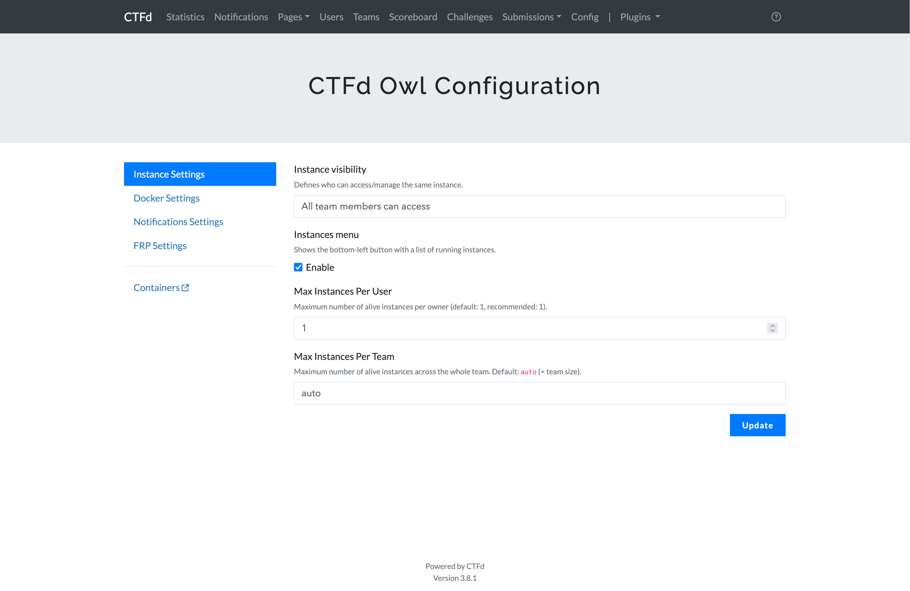
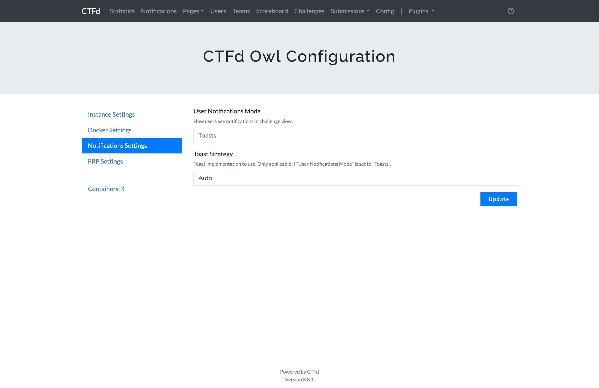
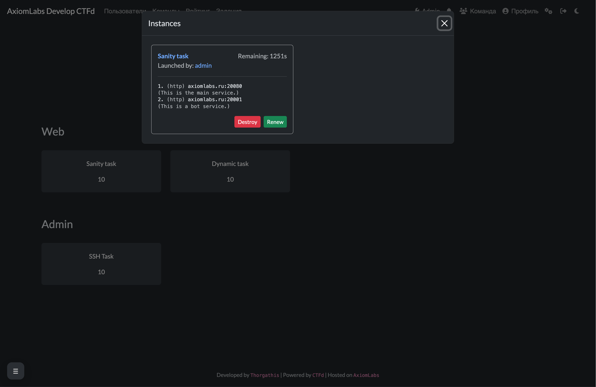

# CTFd-owl

## Возможности

1. Несколько динамических контейнеров и портов на задание.
2. Порты рандомизируются при каждом запуске.
3. Поддерживаются режимы CTFd: индивидуальный (users) и командный (teams). Владение инстансом всегда per-user (контейнеры привязаны к пользователю), а настройка видимости определяет, могут ли тиммейты просматривать и управлять инстансами друг друга.
4. Флаг задания может быть как статическим (plaintext, или проверка regex), так и динамическим.
5. Переменная окружения `FLAG` всегда прокидывается в контейнеры при старте: в статическом режиме это заданный флаг, в динамическом — уникальный флаг для инстанса.
6. Конфигурация контейнера — от комментариев до проксирования — задаётся декларативно через лейблы Docker Compose.
7. Поддерживаются разные типы сообщений (toasts, modals) о статусе контейнеров, а также старые темы, основанные на core, и новые.

### Лейблы

Проксируемые контейнеры должны иметь как минимум первые два лейбла из следующих:

- `owl.proxy=true` - показывает CTFd-Owl, что контейнер нужно проксировать
- `owl.proxy.port=8080` - порт внутри контейнера, на который будет идти трафик (например, 8080)
- `owl.label.conntype=nc` - тип подключения (http/https/nc/ssh/telnet), показывается как `(nc)` перед `ip:port` в карточке задания
- `owl.label.comment=My comment.` - показывается как `(My comment.)` на следующей строке после `ip:port` в карточке задания
- `owl.ssh.username=ctf` - используется только когда `owl.label.conntype=ssh` (показывается как `ssh ctf@ip -p port` в карточке задания)
- `owl.ssh.password=secret` - пароль для SSH (опционально; игнорируется в UI, если указан `owl.ssh.key`)
- `owl.ssh.key=id_rsa` - имя SSH-ключа (опционально; в UI имеет приоритет над паролем)

Отображение данных для подключения изменено для `nc`, `telnet` и `ssh`.

### Сети

Чтобы FRP мог проксировать трафик в контейнер, он должен находиться в сети `net`, где `net`:

```
networks:
    net:
        external:
            name: ctfd_frp_containers
```

Однако, если в задании есть несколько контейнеров (например, `service1` и `service2`), и `service1` делает HTTP-запрос к `http://service2`, то при запуске задания у нескольких участников в одной сети окажется несколько контейнеров с именем `service2`. Это приведёт к тому, что Docker DNS начнёт отдавать несколько A-записей.

Чтобы предотвратить это, если в вашем задании несколько сервисов и хотя бы один обращается к другому по имени, не помещайте сервис, которому не нужно проксирование, в `net` — вместо этого создайте сеть с названием `CTFD_PRIVATE_NETWORK` и поместите его в неё. `CTFD_PRIVATE_NETWORK` будет заменено плагином на строку формата `{prefix}_user{user_id}_{dirname}` в процессе настройки контейнеров.

## Установка

**Требуется: CTFd >= v3.7.7**

Скрипт установки:

```shell
# Установите Docker
curl -fsSL https://get.docker.com -o get-docker.sh
sh get-docker.sh

# Замените <workdir> на нужную вам директорию
cd <workdir>
git clone https://github.com/CTFd/CTFd.git -b 3.7.7 # Рекомендованная версия, но вы можете обновиться.
git clone https://github.com/mscw-infosec/CTFd-owl.git
cp -r CTFd-owl/* CTFd
mkdir -p /home/docker
```

Не забудьте задать переменные `SECRET_KEY`, `MYSQL_PASSWORD` и другие подобные в вашем `docker-compose.yml`.

Запустите эту команду в корне CTFd для развёртывания платформы:

```shell
docker compose up -d
```

## Конфигурация

### Настройки инстансов



|          Options           |                                                          Content                                                          |
| :------------------------: | :-----------------------------------------------------------------------------------------------------------------------: |
|  **Instance visibility**   | Управление доступом к запущенным инстансам. Варианты: всем членам команды / у каждого свой (только при Teams Mode в CTFd) |
|     **Instances menu**     |             Плавающая кнопка внизу слева на странице `/challenges`, показывающая список всех живых инстансов              |
| **Max Instances Per User** |                           Максимальное число живых инстансов (по разным таскам) на пользователя                           |
| **Max Instances Per Team** |               максимальное число живых инстансов на всю команду; значение `auto` означает «размер команды»                |

### Настройки уведомлений



|           Options           |                                                                        Content                                                                        |
| :-------------------------: | :---------------------------------------------------------------------------------------------------------------------------------------------------: |
| **User Notifications Mode** |                          Как показывать пользователю уведомления: Toast (всплывающие сообщения) или Modal (модальные окна).                           |
|     **Toast Strategy**      | Реализация тостов для поддержки разных тем, **basicToasts** (core-beta), **notifyToasts** (core), а также **manual** реализация - **bootstrapToasts** |

### Настройки Docker


|           Options            |                                  Content                                  |
| :--------------------------: | :-----------------------------------------------------------------------: |
|    **Docker Flag Prefix**    |                               Префикс флага                               |
|      **Docker API URL**      |       URL/путь к API (по умолчанию — `unix:///var/run/docker.sock`)       |
|   **Max Container Count**    |   Максимальное количество контейнеров (по умолчанию — без ограничений)    |
| **Docker Container Timeout** | Максимальное время жизни контейнера (по истечении контейнер будет удалён) |
|    **Max Renewal Times**     |        Максимальное количество продлений времени жизни контейнера         |

### FRP Settings


|           Options           |                                           Content                                           |
| :-------------------------: | :-----------------------------------------------------------------------------------------: |
| **Frp Http Domain Suffix**  |  Суффикс домена FRP (нужен для динамического DNS, используется редко, по умолчанию `None`)  |
|      **FRPS address**       |               Адрес сервера с FRP, показывается участникам в связке `ip:port`               |
|      **FRPC address**       |                              Адрес клиента с FRP, обычно frpc                               |
|        **FRPC port**        |                               Порт клиента с FRP, обычно 7440                               |
| **Frp Direct Minimum Port** |  Минимальный порт (должен быть идентичен минимальному порту `frps` в `docker-compose.yml`)  |
| **Frp Direct Maximum Port** | Максимальный порт (должен быть идентичен максимальному порту `frps` в `docker-compose.yml`) |
|  **Frpc config template**   |             Шаблон конфига с данными FRP, на основе его обновляется `frpc.toml`             |

Ниже приведён пример шаблона конфигурации FRP.
Пожалуйста, создайте случайную строку и замените ей значение `auth.token`. Не забудьте также обновить `auth.token` в `frp/conf/frps.toml` и `frp/conf/frpc.toml`.

```ini
serverAddr = "frps"
serverPort = 80

auth.method = "token"
auth.token = "CHANGE_THIS_TOKEN_TO_RANDOM_VALUE"

webServer.addr = "10.1.0.4"
webServer.port = 7400
webServer.user = "admin"
webServer.password = "admin"

transport.tcpMux = false
transport.poolCount = 1
```

### Добавление задач

- Пример обычной задачи приведён в `CTFd/plugins/ctfd-owl/source/tasks/sanity-task`.
- Пример задачи с динамическим флагом приведён в `CTFd/plugins/ctfd-owl/source/tasks/dynamic-task`.
- Пример задачи с SSH приведён в `CTFd/plugins/ctfd-owl/source/tasks/ssh-task`.

Во всех случаях контейнер получает `FLAG` автоматически (смотрите `FLAG=${FLAG}` в compose-файлах примеров).

Вы можете создать свои задачи на их основе.

### Демо

В репозитории также добавлена тема pixo (автор — hmrserver, адаптирована michaelsantosti для CTFd v3.7.7 и JustMarfix для CTFd-Owl). Она доступна в папке `themes` этого репозитория.





