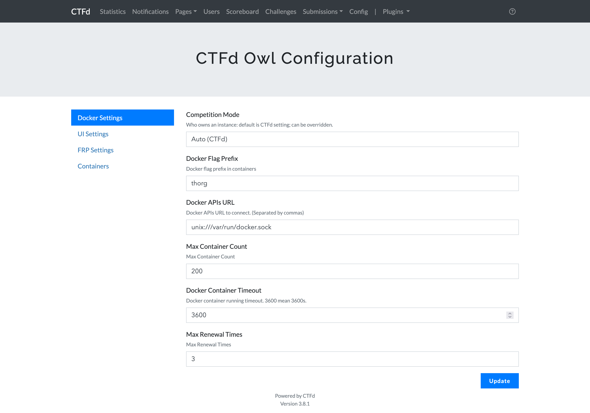
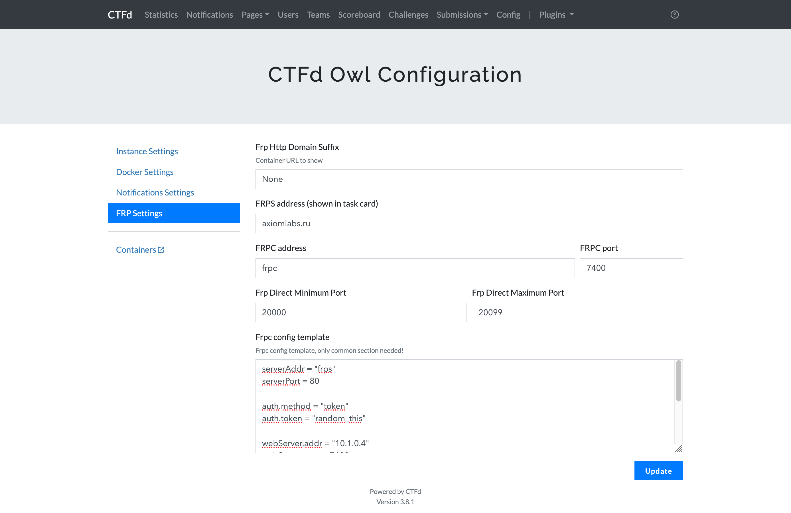
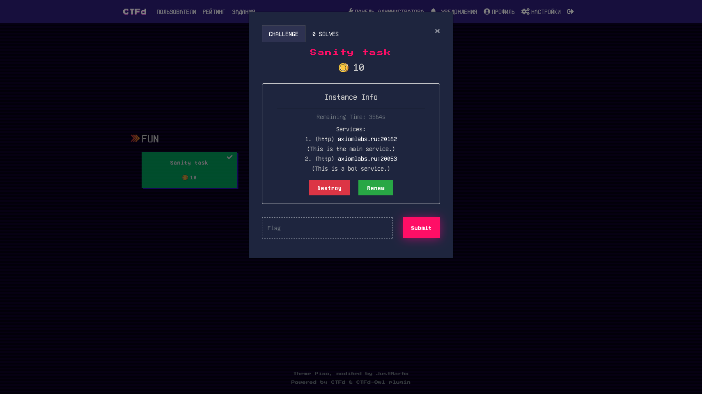
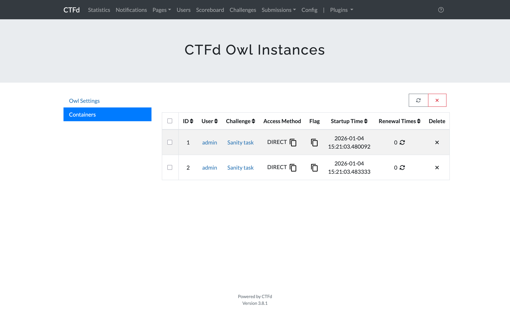

# CTFd-owl

**Dynamic Check Challenges with docker-compose for CTFd**

Forked from [CTFd-Owl](https://github.com/BIT-NSC/ctfd-owl.git) by BIT-NSC.
Added english documentaion & updated scripts.

## Features

1. The port is randomized on each container startup.
2. Adapted to "teams" and "users" modes. In "teams" mode, users of the same team will use the same container.
3. Unlike in BIT-NSC's version, dynamic flags have no support.


## Installation

**REQUIRES: CTFd == v3.4.0**

Install script:

```shell
# install docker
curl -fsSL https://get.docker.com -o get-docker.sh
sh get-docker.sh

# replace <workdir> to your workdir
cd <workdir>
git clone https://github.com/CTFd/CTFd.git -b 3.4.0
git clone https://github.com/JustMarfix/CTFd-owl.git
cp -r CTFd-owl/* CTFd
mkdir -p /home/docker

# make sure you have pip3 installed on your server
pip3 install docker-compose
```

The above command will try to install `docker-ce`, `python3-pip` and `docker-compose`. Before executing them, make sure
the following requirements are met:

* You have `curl`、`git`、`python3` and `pip` installed
* GitHub is accessible
* Docker Registry is accessible

If you want to use nginx, please use `single-nginx.yml`, otherwise use `single.yml` (please modify the nginx
configuration yourself under `conf`).
Please randomly generate sensitive information such as `SECRET_KEY`, `MYSQL_PASSWORD`, etc. in the `*.yml` you want to
use.

```shell
# if you want to use nginx
docker-compose -f CTFd/single-nginx.yml up -d
# or no nginx
docker-compose -f CTFd/single.yml up -d
# wait till the containers are ready
```

You're all set! The next step is configuration.

## How to Use

### Configuration

#### Docker Settings



|           Options            |                                                 Content                                                  |
|:----------------------------:|:--------------------------------------------------------------------------------------------------------:|
|    **Docker Flag Prefix**    |                                                  Flag前缀                                                  |
|     **Docker APIs URL**      |                            API url/path（default `unix://var/run/docker.sock`）                            |
|   **Max Container Count**    |                           Maximum number of containers (unlimited by default)                            |
| **Docker Container Timeout** | The maximum running time of the container (it will be automatically destroyed after the time is reached） |
|     **Max Renewal Time**     |                Maximum container renewal times (cannot be renewed if the number exceeds）                 |

#### FRP Settings



|           Options           |                                                            Content                                                             |
|:---------------------------:|:------------------------------------------------------------------------------------------------------------------------------:|
| **FRP Http Domain Suffix**  |                        FRP domain name prefix (required if dynamic domain name forwarding is enabled)）                         |
|  **FRP Direct IP Address**  |                                                         FRP server IP                                                          |
| **FRP Direct Minimum Port** |          Minimum port (keep the same as the minimum port segment mapped to the outside by `frps` in `docker-compose`)          |
| **FRP Direct Maximum Port** |                                                  Maximum port (same as above)                                                  |
|   **FRP config template**   | frpc hot reload configuration header template (if you don't know how to customize it, try to follow the default configuration) |

Please generate a random token and replace it with random_this. Then modify the token in `frp/conf/frps.ini` and `frp/conf/frpc.ini` to match it.
```ini
[common]
token = random_this
server_addr = frps
server_port = 80
admin_addr = 10.1.0.4
admin_port = 7400
```

### Add Challenge

Just add the task, that's all.

### Demo

下图的主题为[CTFd-theme-pixo](https://github.com/BIT-NSC/CTFd-theme-pixo)





