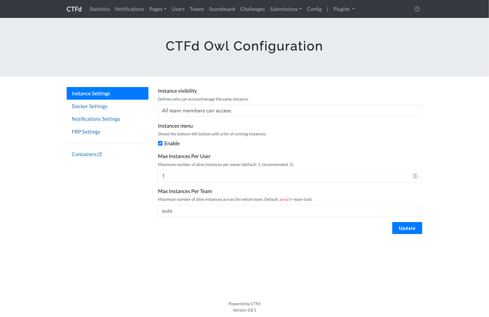
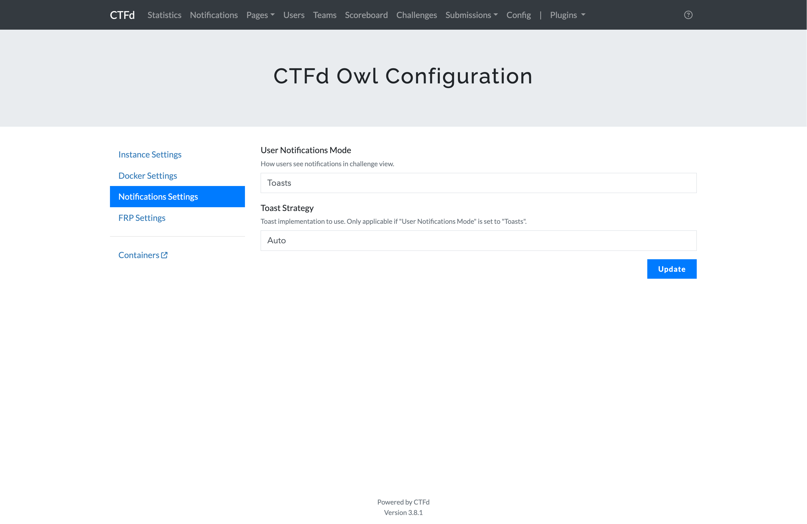
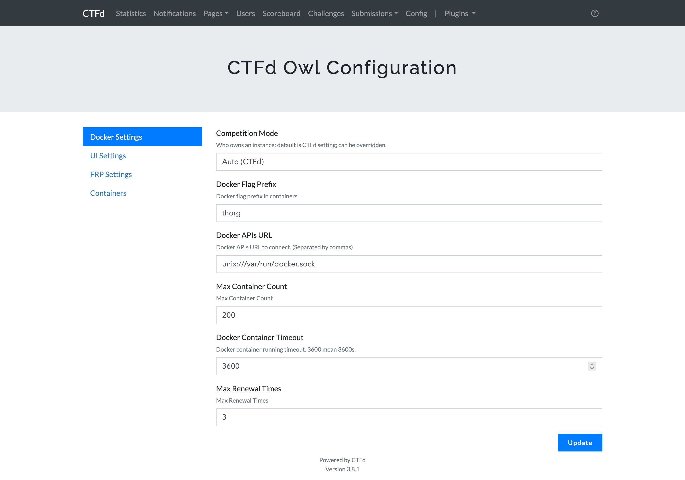
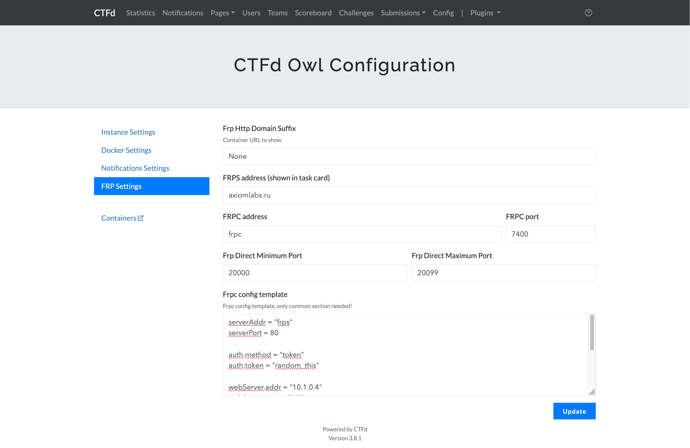
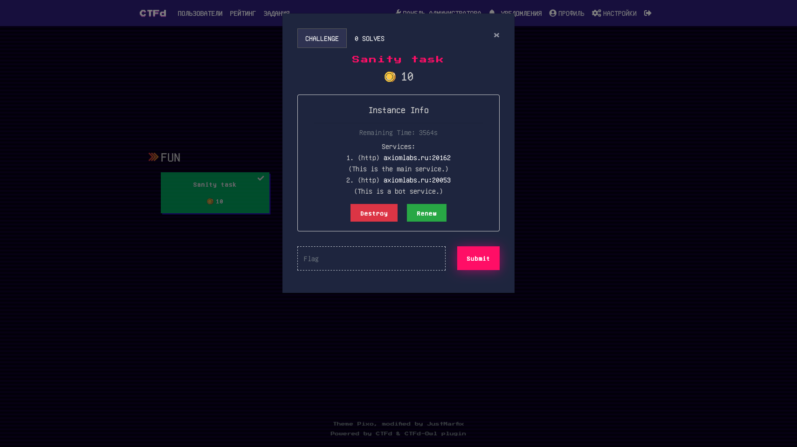
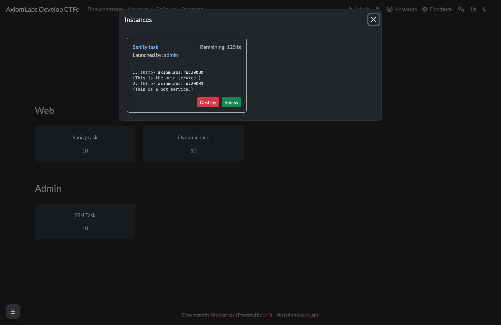
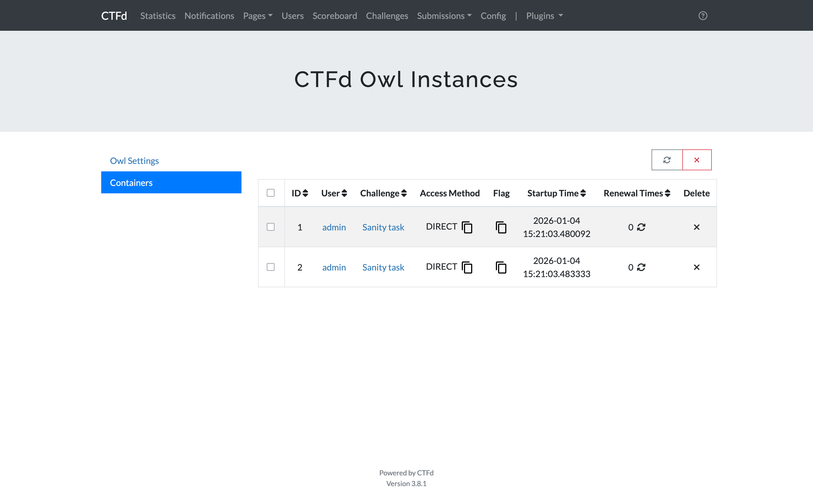

# CTFd-owl

Russian version of this README is available [here](./README-RU.md).

## Features

1. Multiple dynamic containers & ports per challenge.
2. Ports are randomized on each start.
3. Adapted to "teams" and "users" modes. Instance ownership is always per-user (containers are tied to a user), while the visibility setting controls whether teammates can view and manage each other’s instances.
4. Both static (plaintext or regex), dynamic, and semi-dynamic (template-based) flags are supported.
5. `FLAG` env var is always exported into containers on startup: in static mode it is the configured flag, in dynamic/semi-dynamic mode it is a per-instance generated flag.
6. Everything about a container (including FRP) is configured declaratively using docker-compose labels.
7. Supports different message types (toasts, modals) about container statuses, and works with both old core-based themes and newer ones.

### Labels

Proxied containers should have at least first two of these labels:

- `owl.proxy=true` - tells CTFd-Owl that container should be proxied
- `owl.proxy.port=8080` - container port that will be connected to FRP (e.g., 8080)
- `owl.label.conntype=nc` - connection type (http/https/nc/ssh/telnet), will be shown as `(nc)` before container's `ip:port` in challenge card
- `owl.label.comment=My comment.` - will be shown as `(My comment.)` next line after container's `ip:port` in challenge card
- `owl.ssh.username=ctf` - SSH username (used only when `conntype=ssh`, shown as `ssh ctf@ip -p port` in challenge card)
- `owl.ssh.password=secret` - SSH password (optional; ignored in UI if `owl.ssh.key` is provided)
- `owl.ssh.key=id_rsa` - SSH key name (optional; preferred over password in UI)

The connection data display has been changed for `nc`, `telnet` and `ssh`.

### Networks

In order for FRP to work properly, proxied containers should have network `net`, where `net` is:

```
networks:
    net:
        external:
            name: ctfd_frp_containers
```

That said, if your challenge has containers `service1` and `service2`, and `service1` makes an HTTP request to `http://service2`, then when multiple participants run the same challenge there may be multiple containers named `service2` in the same network. In that case, Docker DNS can return multiple A records, leading to undefined behavior.

To prevent this, if you make a challenge with multiple services that connect to each other by name, put services that don't need to be proxied into the `CTFD_PRIVATE_NETWORK` network, and don't put them in `net`. `CTFD_PRIVATE_NETWORK` will be replaced with `{prefix}_u{user_id}_c{challenge_id}_{dirname}` while setting up containers.

## Installation

**REQUIRES: CTFd >= v3.7.7**

Install script:

```shell
# Install Docker
curl -fsSL https://get.docker.com -o get-docker.sh
sh get-docker.sh

# replace <workdir> with your workdir
cd <workdir>
git clone https://github.com/CTFd/CTFd.git -b 3.7.7 # Recommended version, but you can update.
git clone https://github.com/mscw-infosec/CTFd-owl.git
cp -r CTFd-owl/* CTFd
mkdir -p /home/docker
```

Please generate random values for sensitive settings such as `SECRET_KEY`, `MYSQL_PASSWORD`, etc. in the `*.yml` you want to use.

To start CTFd, run this command from the CTFd root:

```shell
docker compose up -d
```

## Configuration

### Instance Settings



|          Options           |                                                         Content                                                         |
| :------------------------: | :---------------------------------------------------------------------------------------------------------------------: |
|  **Instance visibility**   | Controls access to running instances. Options: visible to all team members / private per user (team mode in CTFd only). |
|     **Instances menu**     |                Floating button (bottom-left) on `/challenges` that shows a list of all alive instances.                 |
| **Max Instances Per User** |                             Maximum number of alive instances (across challenges) per user.                             |
| **Max Instances Per Team** |                   Maximum number of alive instances across the whole team; `auto` means “team size”.                    |

### Notifications Settings



|           Options           |                                                                       Content                                                                       |
| :-------------------------: | :-------------------------------------------------------------------------------------------------------------------------------------------------: |
| **User Notifications Mode** |                              How users see notifications in the challenge view: `toast` (toasts) or `modal` (modals).                               |
|     **Toast Strategy**      | Toast implementation (used only when mode is `toast`): `auto`, `basicToasts` (core-beta), `notifyToasts` (core themes), `bootstrapToasts` (manual). |

### Docker Settings



|           Options            |                                                 Content                                                  |
| :--------------------------: | :------------------------------------------------------------------------------------------------------: |
|    **Docker Flag Prefix**    |                                               Flag prefix                                                |
|   **Dynamic Flag Length**    |                      Generated chunk length for fully dynamic flags                                       |
| **Semi-Dynamic Flag Length** |                    Default length for `$[!gen!]` in semi-dynamic templates                                |
|      **Docker API URL**      |                           API URL/path (default `unix:///var/run/docker.sock`)                           |
|   **Max Container Count**    |                           Maximum number of containers (unlimited by default)                            |
| **Docker Container Timeout** | The maximum running time of the container (it will be automatically destroyed after the time is reached) |
|    **Max Renewal Times**     |                Maximum container renewal times (cannot be renewed if the number exceeds)                 |

### FRP Settings



|           Options           |                                                            Content                                                             |
| :-------------------------: | :----------------------------------------------------------------------------------------------------------------------------: |
| **Frp Http Domain Suffix**  |                           FRP domain suffix (required only if dynamic domain forwarding is enabled)                            |
|      **FRPS address**       |                                                         FRP server IP                                                          |
|      **FRPC address**       |                                                FRP client address, default frpc                                                |
|        **FRPC port**        |                                                 FRP client port, default 7440                                                  |
| **Frp Direct Minimum Port** |          Minimum port (keep the same as the minimum port segment mapped to the outside by `frps` in `docker-compose`)          |
| **Frp Direct Maximum Port** |          Maximum port (keep the same as the maximum port segment mapped to the outside by `frps` in `docker-compose`)          |
|  **Frpc config template**   | frpc hot reload configuration header template (if you don't know how to customize it, try to follow the default configuration) |

Below is an example of an FRP configuration template.
Please generate a random token and replace `auth.token` with it. Then modify the token in `frp/conf/frps.toml` and `frp/conf/frpc.toml` to match it.

```ini
serverAddr = "frps"
serverPort = 80

auth.method = "token"
auth.token = "CHANGE_THIS_TOKEN_TO_RANDOM_VALUE"

webServer.addr = "10.1.0.4"
webServer.port = 7400
webServer.user = "admin"
webServer.password = "admin"

transport.tcpMux = false
transport.poolCount = 1
```

### Add Challenge

- An example of a common task is given in the `CTFd/plugins/ctfd-owl/source/tasks/sanity-task`.
- An example of a task with a dynamic flag is given in `CTFd/plugins/ctfd-owl/source/tasks/dynamic-task`.
- An example of an SSH task is given in `CTFd/plugins/ctfd-owl/source/tasks/ssh-task`.
- An example of a multitask challenge (one container, several linked tasks and flags) is given in `CTFd/plugins/ctfd-owl/source/tasks/dynamic-multitask`.

In all cases the container receives `FLAG` automatically (see `FLAG=${FLAG}` in the example compose files).

#### Dynamic multitask (`dynamic_check_docker_multi`)

A multitask challenge launches a **single container that backs several linked tasks**. Each task gets its own per-instance dynamic flag, injected into the container as `FLAG1`, `FLAG2`, ... `FLAGN` (`FLAG` equals `FLAG1` for backward compatibility). The container is shown as running on **every** task in the group, and each task only accepts its own flag.

- When creating the challenge, pick type **Dynamic multitask**, set the **Dirname** (which holds the shared docker-compose) and the **Number of flags / tasks** (N). The challenge you create is the group parent (task #1); the remaining N−1 tasks are auto-created as child challenges that inherit the parent's visibility state (and follow it when you later change it) — edit them as needed.
- The compose must expose `FLAG1..FLAGN` as environment variables (see the `dynamic-multitask` example). Task `k` is solved with the value of `FLAG<k>`.
- Deploying, renewing or destroying the instance from any task in the group affects the whole group; the group counts as a single instance against per-user/per-team limits.
- You can add, remove or renumber tasks afterwards from the challenge update page (`Flag index` / `Parent challenge id`), e.g. to end up with 2 or 4 flags instead of 3.

Semi-dynamic flags are defined as a regular CTFd plaintext flag template, for example:

- `ctf{Y0u_F1nd_M3_$[!gen!]}` — `$[!gen!]` will be replaced with a random string of length **Semi-Dynamic Flag Length**.
- `ctf{Y0u_F1nd_M3_$[!gen:06!]}` — generates 6 characters (overrides the default length per placeholder).

You can create your own tasks based on them.

### Demo

Theme pixo included into the repo (originally by hmrserver, modified by michaelsantosti for v3.7.7 & JustMarfix for CTFd-Owl). It is available in `themes` folder of this repo.






